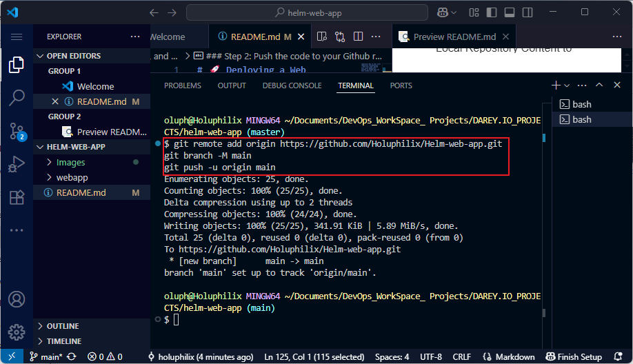

# 🚀 Deploying a Web Application Using Helm in Kubernetes

## 📌 Introduction to Helm

**Helm** is a package manager for Kubernetes applications. It simplifies the deployment and management of applications on Kubernetes by providing a way to define, install, and upgrade even the most complex Kubernetes applications.

This project is designed to give you a **hands-on experience** with Helm — a critical tool in the cloud-native stack. You'll learn how to:

- Install and verify Helm
- Create a new Helm chart
- Use Git for version control
- Deploy a simple web application in a Kubernetes cluster using Helm

### 🧠 Analogy  
- Think of Kubernetes as a kitchen and your applications as dishes.  
- **Helm** is the recipe book that includes ingredients (containers, services, configurations) and cooking instructions (YAML files).  
- With Helm, you can consistently prepare your applications, even under pressure — just like a chef in a busy kitchen.

## 📂 Project Overview

In this project, you will:

- Create and configure a Helm chart
- Deploy a web app to Kubernetes
- Version control the setup using Git
- Optionally integrate with CI/CD in future phases


## ✅ Prerequisites

Before starting, make sure you have the following:

- ✅ Completion of Core Programs 1–4
- ✅ Kubernetes setup (Minikube, Kind, GKE, EKS, or AKS)
- ✅ Git installed and connected to a repository
- ✅ Basic Kubernetes knowledge (Pods, Deployments, Services)
- ✅ Jenkins server (for later CI/CD steps)
- ✅ Docker installed
- ✅ Command-line proficiency

## 🚀 Task 1: Install Helm

### Step 1: Open VSCode

- Run VSCode as **Administrator**
- Open the integrated **Terminal**

**Screenshot:**  


### Step 2: Install Helm via Chocolatey

Chocolatey is a Windows package manager similar to `apt` or `yum`.

```powershell
choco install kubernetes-helm
```

**Screenshot:**


### Step 3: Verify Helm Installation

Run the following command in PowerShell or your terminal to verify the installation:

```powershell
helm version
```
**Screenshot:**


## 📦 Task 2: Create a New Helm Chart

### Step 1: Create Project Directory

```bash
mkdir helm-web-app
cd helm-web-app
```
**Screenshot:**


### Step 2 Generate a Helm Chart

```bash
helm create webapp
```
**Screenshot:**


This command creates a scaffolded Helm chart named `webapp` with default templates and structure.

## ✅ Task 3: Git Staging, Committing, and Pushing Code to GitHub
### Step 1: Stage and Commit the Template to Git
In this step, I will add the website files to the Git repository, configure my global Git settings, and make an initial commit with a descriptive message.
- Add Files: Add all website files to the staging area.
- Configure Git User Information: Set up global configuration with my actual git username and email address.
- Commit Changes: Commit the changes with a clear and descriptive message.
__Commands:__
```bash
git init
git add .
git config --global user.name "holuphilix"
git config --global user.email "oluphilix@gmail.com"
git commit -m "Initial Helm chart commit"
```
**Screenshot:**

### Step 2: Push the code to your Github repository
After initializing your Git repository and adding your WordPress site template, the next step is to push your code to a remote repository on GitHub. This step is crucial for version control and collaboration.
- Create a Remote Repository on GitHub: Log into your GitHub account and create a new repository named __Helm-web-app__. Leave the repository empty without initializing it with a README, .gitignore, or license.
**Screenshot 1:**

**Screenshot 2:**

- Link Your Local Repository to GitHub: In your terminal, within your project directory, add the remote repository URL to your local repository configuration.
- Push Your Code: Upload Your Local Repository Content to GitHub Once you have linked your local repository to GitHub, use the following command to push your commits from your local main branch to the remote repository. This enables you to store your project in the cloud and share it with others.
__Commands:__
```bash
git remote add origin https://github.com/Holuphilix/Helm-web-app.git
git branch -M main
git push -u origin main
```
**Screenshot:**


## ✅ Task 4: Conclusion

In this project, you've successfully:

- Installed Helm on your local machine
- Created a Helm chart for a web application
- Version-controlled the project using Git
- Prepared the foundation for deploying applications to a Kubernetes cluster

By mastering the basics of Helm, you've taken a significant step toward simplifying Kubernetes application deployments. Helm helps manage complexity, improve consistency, and streamline the CI/CD pipeline for cloud-native applications.
## Author
**Philip Oluwaseyi Oludolamu**
DevOps Engineer 

* ✉️ Email: [oluphilix@gmail.com](mailto:oluphilix@gmail.com)
* 🔗 LinkedIn: [linkedin.com/in/philipoludolamu](https://www.linkedin.com/in/philipoludolamu)
*Completed on June 29, 2025*

